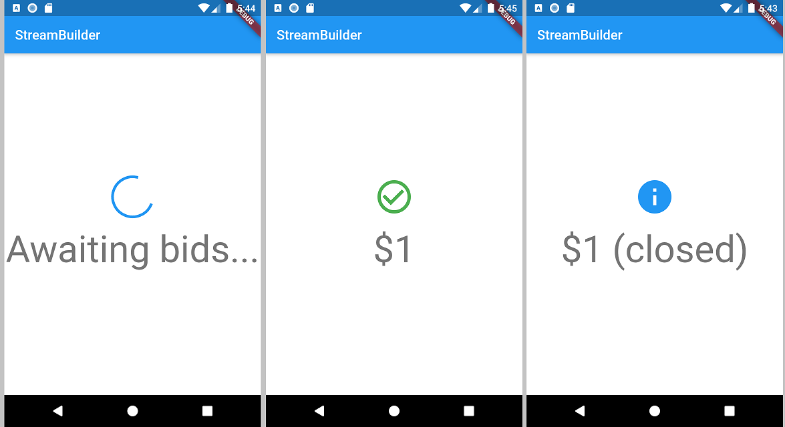

## StreamBuilder sample

This sample shows a StreamBuilder that listens to a Stream that emits bids for an auction. Every time the StreamBuilder receives a bid from the Stream, it will display the price of the bid below an icon. If the Stream emits an error, the error is displayed below an error icon. When the Stream finishes emitting bids, the final price is displayed.

https://api.flutter.dev/flutter/widgets/StreamBuilder-class.html

https://youtu.be/MkKEWHfy99Y

***

